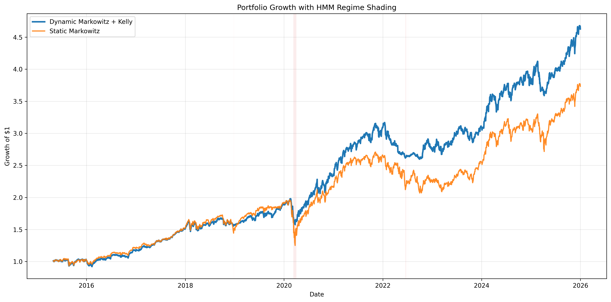
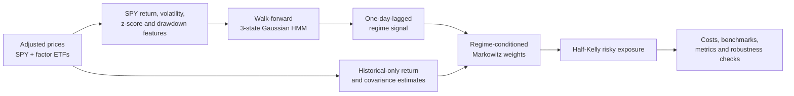

# Market Regime Detection and Dynamic Asset Allocation

Can market regimes inferred using only information available at each decision date improve dynamic portfolio allocation relative to static benchmarks?

This research project combines a walk-forward Gaussian Hidden Markov Model (HMM), rolling Markowitz allocation, fractional Kelly exposure, and transaction-cost modelling across four US equity factor ETFs. The tracked experiment reduced volatility and drawdown, but did not improve return or Sharpe versus SPY—an informative result rather than a selectively reported win.

## Tracked out-of-sample results

The current output covers 2,431 trading observations from 3 May 2016 through 31 December 2025. Returns are net of 5 bps per unit of one-way turnover where applicable.

| Strategy | CAGR | Volatility | Sharpe | Max drawdown |
| --- | ---: | ---: | ---: | ---: |
| Dynamic HMM + Markowitz + Kelly, net | 9.49% | 12.87% | 0.614 | -19.65% |
| Rolling Markowitz | 12.34% | 17.56% | 0.637 | -36.74% |
| Equal-weight factors | 12.84% | 17.25% | 0.671 | -34.98% |
| SPY buy and hold | 14.99% | 18.06% | 0.754 | -33.72% |



The regime-aware strategy produced the lowest volatility and shallowest maximum drawdown. SPY retained the strongest CAGR and Sharpe ratio.

## Research design



The risky universe is `MTUM`, `VLUE`, `QUAL`, and `USMV`. SPY supplies market-regime features and serves as a buy-and-hold benchmark.

## Research integrity

- **Temporal fitting:** the first 252 observations form the warm-up. At each refit, the scaler and HMM see only earlier dates.
- **Forward filtering:** state probabilities update one observation at a time; no future-state smoothing is used.
- **Signal timing:** the inferred regime is shifted one trading day before it can affect portfolio returns.
- **Historical inputs:** expected returns and covariance use only factor returns preceding the traded day.
- **Comparable windows:** all strategies share the same post-warm-up dates.
- **Explicit frictions:** optimized portfolios pay 5 bps per unit of one-way turnover by default.
- **Automated checks:** tests cover future-data independence, filtering, state mapping, signal lagging, constraints, Kelly bounds, costs, benchmarks, and performance arithmetic.

## Default specification

| Component | Setting |
| --- | --- |
| Data request | 1 Jan 2015–1 Jan 2026 (Yahoo Finance end date is exclusive) |
| HMM | 3 Gaussian states; expanding history; refit every 21 trading days |
| Regimes | Risk-On, Neutral, Risk-Off, mapped from historical return/volatility/drawdown statistics |
| Allocation | 126-day estimates; long-only; weights sum to 1; 75% maximum per factor |
| Risk aversion | 2.0 / 3.0 / 4.0 for Risk-On / Neutral / Risk-Off |
| Exposure | Half-Kelly, clipped to 0–100%; 2% constant annual cash return |
| Costs | 5 bps per unit of one-way turnover |

Robustness scenarios vary HMM state count, refit frequency, allocation lookback, costs, and Kelly fraction.

## Run the study

Python 3.12 or newer is recommended.

```bash
python -m venv .venv
source .venv/bin/activate
pip install -r requirements-dev.txt
python main.py
```

```bash
python main.py --run-sensitivity
```

Run `python main.py --help` for configurable assumptions.

## Repository map

```text
config.py                       central research configuration
Data_Extraction.py              downloads prices and creates market features
Data_Train_HMM.py               walk-forward HMM fitting and filtering
Dynamic_asset_allocation.py     allocation, exposure, costs, and metrics
Data_Visualisation.py           tables, plots, and report generation
sensitivity_analysis.py         predefined robustness scenarios
main.py                         command-line pipeline
tests/                          research-integrity tests
outputs/                        tracked results from the current methodology
```

## Quality checks

```bash
pytest
ruff check .
mypy config.py Data_Extraction.py Data_Train_HMM.py Dynamic_asset_allocation.py Data_Visualisation.py main.py
python -m pip check
```

## Limitations

- Yahoo Finance is not an institutional point-in-time database and historical values can be revised.
- The risk-free rate is constant rather than a historical Treasury series.
- Costs omit spreads, market impact, taxes, and ETF fees; execution uses close-to-close returns.
- Regime labels are latent statistical interpretations, not observed economic states.
- Expected returns, covariances, HMM parameters, and Kelly exposure are estimation-sensitive.
- Default settings are research choices, not parameters selected for future performance.

This is an academic research backtest, not investment advice.

## Author

**Sifeddine El Kadiri** — Finance & Computer Science Engineering Student at ENSIAS
